---
## Front matter
title: "ОТЧЕТ"
subtitle: "по лабораторной работе №7"
author: "Андриевская Анастасия Андреевна НПИбд-01-21 1032211699"

## Generic otions
toc-title: "Содержание"

## Bibliography
bibliography: bib/cite.bib
csl: pandoc/csl/gost-r-7-0-5-2008-numeric.csl

## Pdf output format
toc: true # Table of contents
toc-depth: 1
lof: true # List of figures
lot: false # List of tables
fontsize: 12pt
linestretch: 1.5
papersize: a4
documentclass: scrreprt
## I18n polyglossia
polyglossia-lang:
  name: russian
  options:
	- spelling=modern
	- babelshorthands=true
polyglossia-otherlangs:
  name: english
## I18n babel
babel-lang: russian
babel-otherlangs: english
## Fonts
mainfont: PT Serif
romanfont: PT Serif
sansfont: PT Sans
monofont: PT Mono
mainfontoptions: Ligatures=TeX
romanfontoptions: Ligatures=TeX
sansfontoptions: Ligatures=TeX,Scale=MatchLowercase
monofontoptions: Scale=MatchLowercase,Scale=0.9
## Biblatex
biblatex: true
biblio-style: "gost-numeric"
biblatexoptions:
  - parentracker=true
  - backend=biber
  - hyperref=auto
  - language=auto
  - autolang=other*
  - citestyle=gost-numeric
## Pandoc-crossref LaTeX customization
figureTitle: "Рис."
tableTitle: "Таблица"
listingTitle: "Листинг"
lofTitle: "Список иллюстраций"
lotTitle: "Список таблиц"
lolTitle: "Листинги"
## Misc options
indent: true
header-includes:
  - \usepackage[utf8]{inputenc}
  - \usepackage[russian]{babel}
  - \usepackage[T1]{fontenc}
  - \usepackage{lmodern}
  - \usepackage{indentfirst}
  - \usepackage{float} # keep figures where there are in the text
  - \floatplacement{figure}{H} # keep figures where there are in the text
---

## **Цель работы:**
Целью данной работы является освоение основных возможностей командной оболочки Midnight Commander и приобретение навыков практической работы по просмотру каталогов и файлов; манипуляций
с ними.

## **Ход работы:**

### **Задание по mc:**
1.	Я изучила информацию о mc, вызвав в командной строке man mc. (рис. 1).

    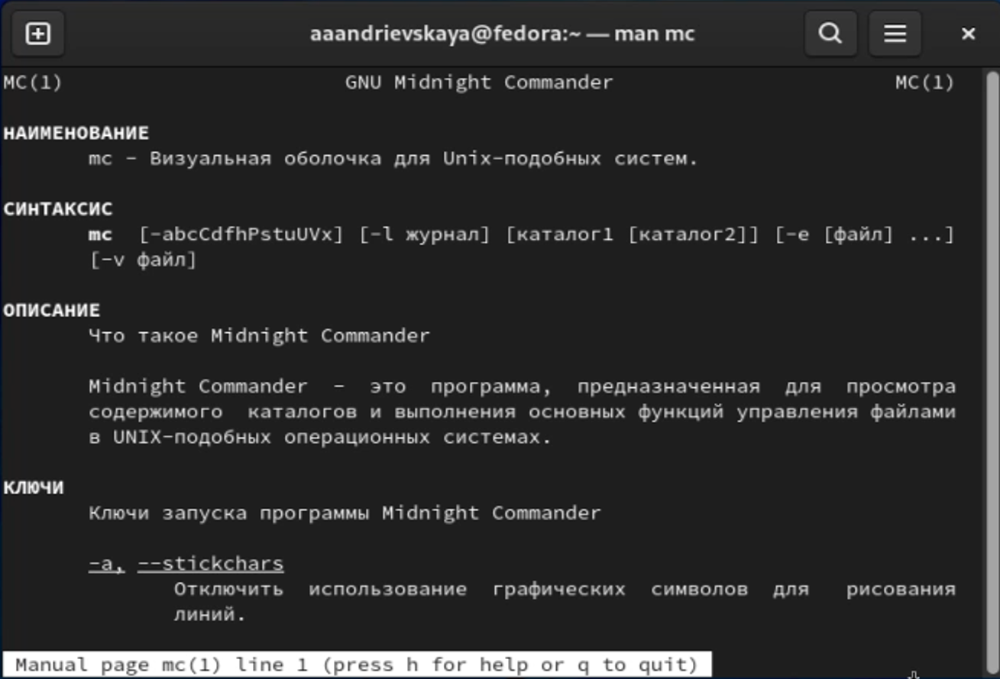

2. Я запустила из командной строки mc, изучив его структуру и меню (рис.2). 
  
    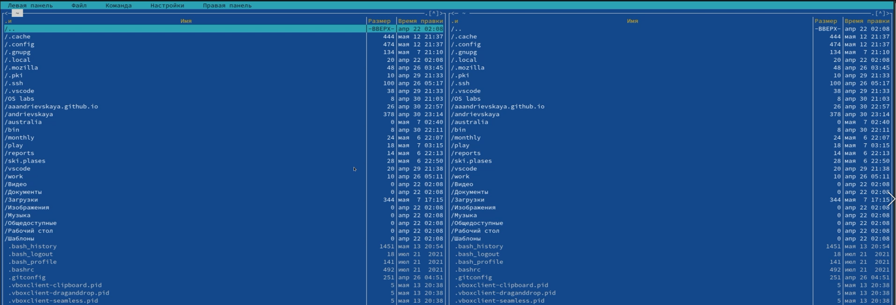

3. Я выполнила несколько операций в mc, используя управляющие клавиши (операции
с панелями; выделение/отмена выделения файлов, копирование/перемещение файлов, получение информации о размере и правах доступа на файлы и/или каталоги
и т.п.) (рис.3).   

    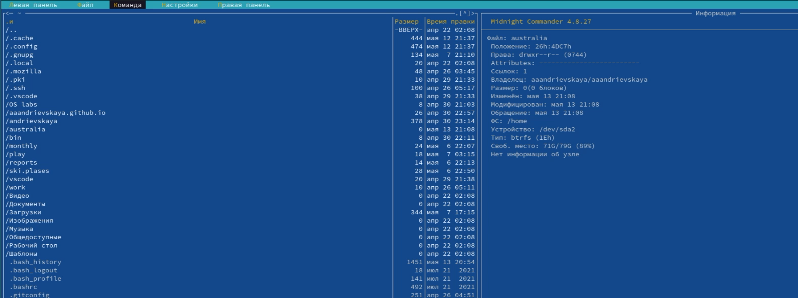
   
4. Я выполнила основные команды меню левой (или правой) панели. Оценила степень
подробности вывода информации о файлах: весьма подробно. (рис. 4).

    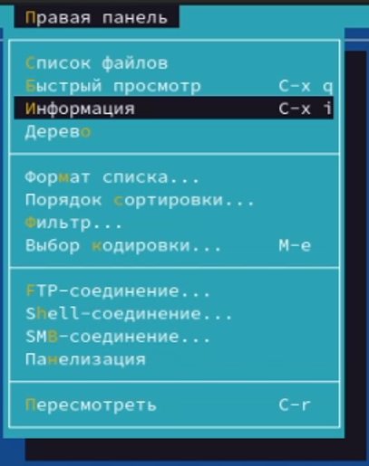

5. Используя возможности подменю Файл, я выполнила:
   1. просмотр содержимого текстового файла (рис. 5.1);
   
        
    2. редактирование содержимого текстового файла (без сохранения результатов
редактирования) (рис. 5.2);

        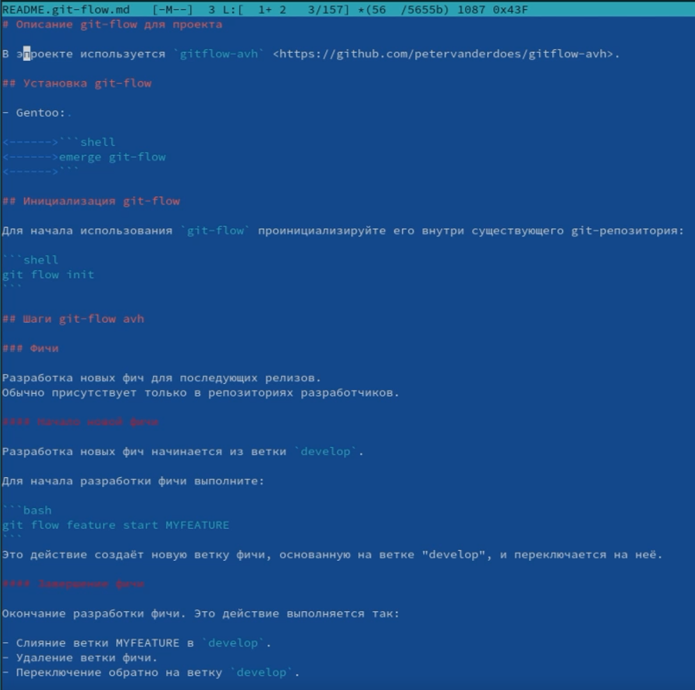
    3. создание каталога (рис. 5.3);
   
        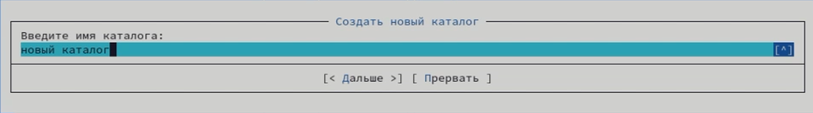
    4. копирование в файлов в созданный каталог (рис. 5.4).
   
        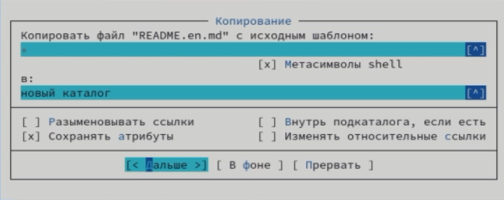
 

6. С помощью соответствующих средств подменю Команда я осуществила:
   1. поиск в файловой системе файла с заданными условиями (например, файла
с расширением .c или .cpp, содержащего строку main) (рис. 6.1);
   
        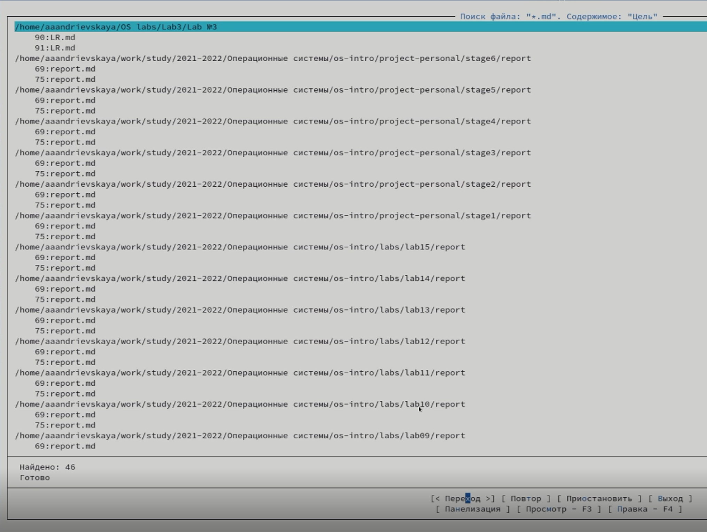
    2. выбор и повторение одной из предыдущих команд (рис. 6.2);

        
    3. переход в домашний каталог (рис. 6.3);
   
        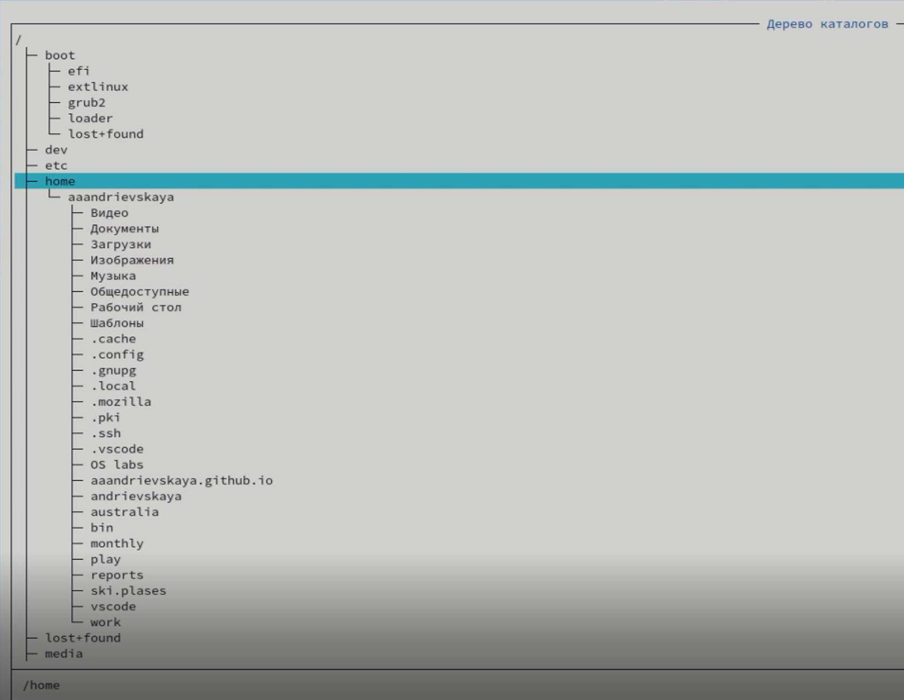
    4. анализ файла меню и файла расширений (рис. 6.4).
   
        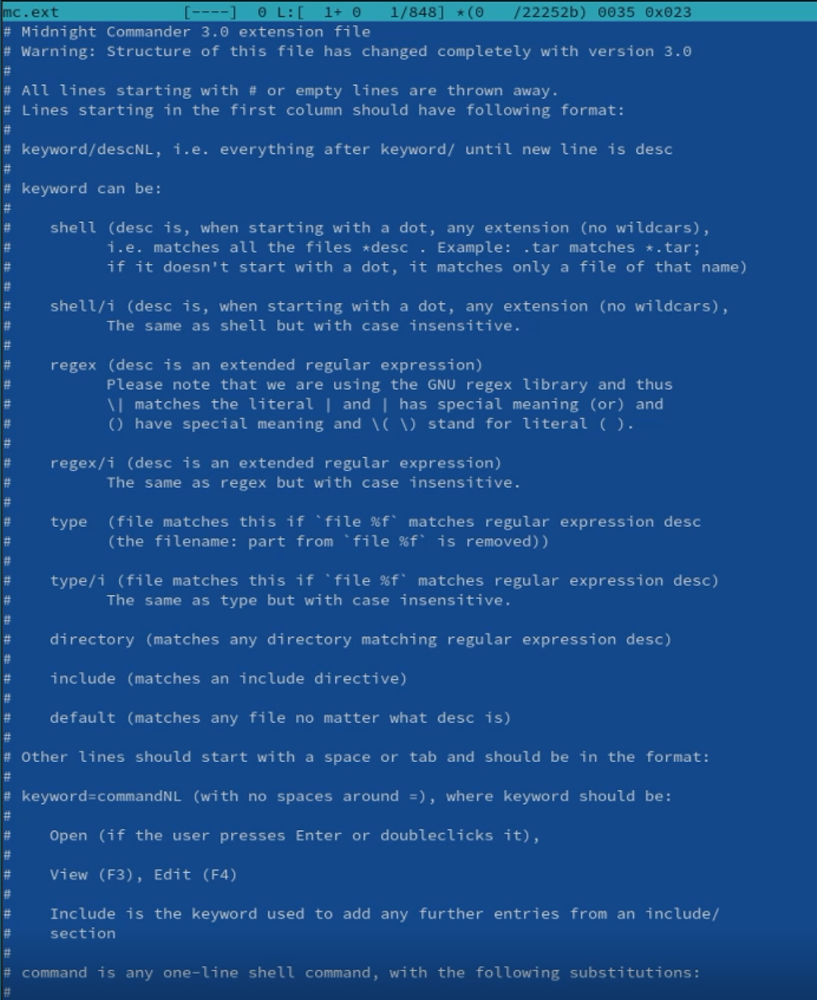
    
7.	Я вызвала подменю Настройки . Освоила операции, определяющие структуру экрана mc
(Full screen, Double Width, Show Hidden Files и т.д.)

    

### **Задание по встроенному редактору mc**

1.	Я создала текстовой файл text.txt. (рис. 8).

    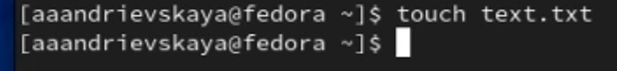

2. Я открыла этот файл с помощью встроенного в mc редактора (рис.9). 
  
    

3. Я вставила в открытый файл небольшой фрагмент текста, скопированный из любого
другого файла или Интернета (рис.10).   

    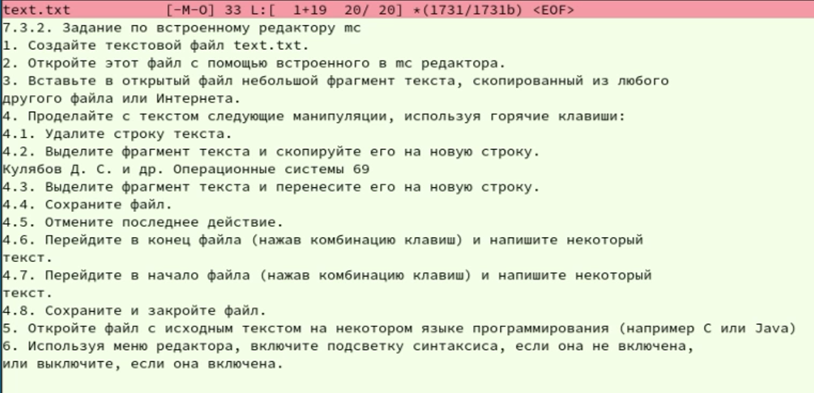

4. Я проделала с текстом следующие манипуляции, используя горячие клавиши:
   1. Удалила строку текста (рис. 11.1);
   
        
    2. Выделила фрагмент текста и скопируйте его на новую строку. (рис. 11.2);

        
    3. Выделила фрагмент текста и перенесите его на новую строку. (рис. 11.3);
   
        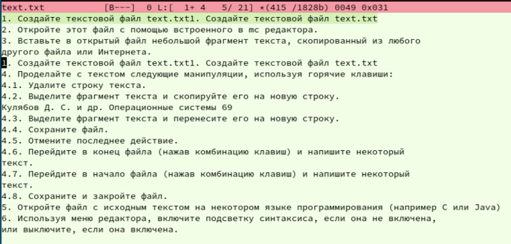
    4. Сохранила файл. (рис. 11.4).
   
        
    5. Отменила последнее действие. (рис. 11.5);

        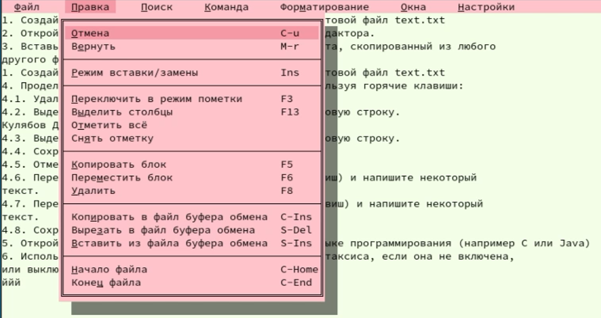
    6. Перешла в конец файла (нажав комбинацию клавиш page down) и написала некоторый
текст (рис. 11.6);
   
        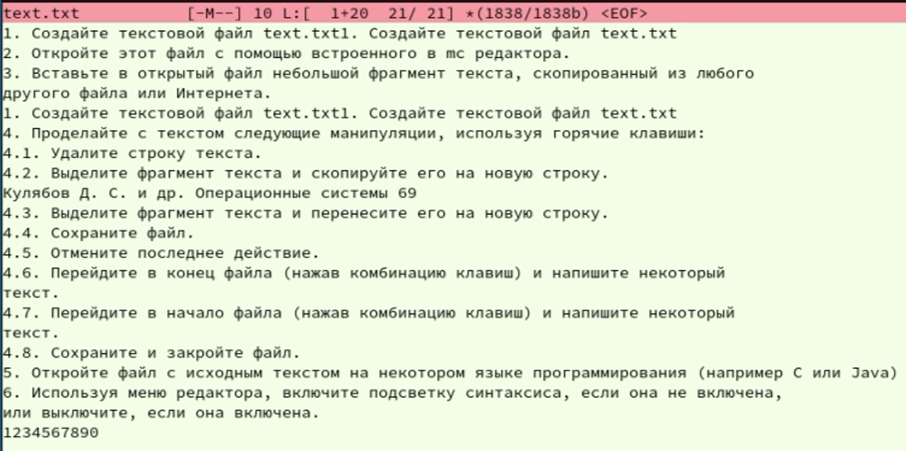
    7. Перешла в начало файла (нажав комбинацию клавиш page up) и написала некоторый
текст (рис. 11.7);
   
        
    8. Сохранила и закрыла файл (рис. 11.8).
   
        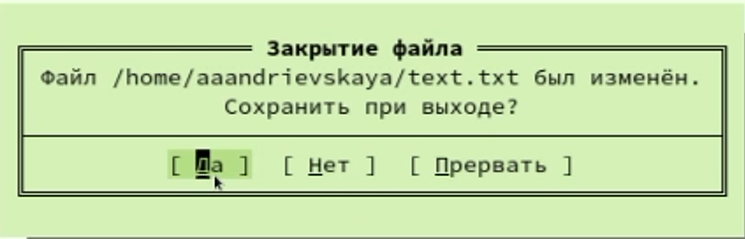
 
 
## **Выводы:** 
Я освоила основные возможности командной оболочки Midnight Commander и приобрела навыки практической работы по просмотру каталогов и файлов; манипуляций
с ними.
