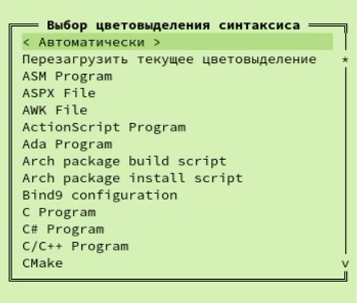

---
## Front matter
lang: ru-RU
title: Презентация лабораторной работы №7
author: |
	Андриевская Анастасия НПИбд-01-21 1032211699
institute: |
	RUDN University, Moscow, Russian Federation
	
date: 2022

## Formatting
toc: false
slide_level: 2
theme: metropolis
header-includes: 
 - \metroset{progressbar=frametitle,sectionpage=progressbar,numbering=fraction}
 - '\makeatletter'
 - '\beamer@ignorenonframefalse'
 - '\makeatother'
aspectratio: 43
section-titles: true
---

# Лабораторная работа №7.

## Цель работы

Целью данной работы является освоение основных возможностей командной оболочки Midnight Commander и приобретение навыков практической работы по просмотру каталогов и файлов; манипуляций
с ними.

### Теоретическое введение

Командная оболочка — интерфейс взаимодействия пользователя с операционной системой и программным обеспечением посредством команд.
Midnight Commander (или mc) — псевдографическая командная оболочка для UNIX/Linux
систем. Для запуска mc необходимо в командной строке набрать mc и нажать Enter .

## Выполнение заданий по mc
Я изучила информацию о mc, вызвав в командной строке man mc. (рис. 1).

## Выполнение заданий по mc

Я запустила из командной строки mc, изучив его структуру и меню (рис.2). 
  

## Выполнение заданий по mc

Я выполнила несколько операций в mc, используя управляющие клавиши (операции
с панелями; выделение/отмена выделения файлов, копирование/перемещение файлов, получение информации о размере и правах доступа на файлы и/или каталоги
и т.п.) (рис.3).   

## Выполнение заданий по mc

Я выполнила основные команды меню левой (или правой) панели. Оценила степень
подробности вывода информации о файлах: весьма подробно. (рис. 4).

## Выполнение заданий по mc

Используя возможности подменю Файл, я выполнила:
   1. просмотр содержимого текстового файла (рис. 5.1);
   
    	

## Выполнение заданий по mc

2. редактирование содержимого текстового файла (без сохранения результатов редактирования) (рис. 5.2);

    

## Выполнение заданий по mc

3. создание каталога (рис. 5.3);
   
    

## Выполнение заданий по mc

4. копирование в файлов в созданный каталог (рис. 5.4).
   
    

## Выполнение заданий по mc

С помощью соответствующих средств подменю Команда я осуществила:
   1. поиск в файловой системе файла с заданными условиями (например, файла
с расширением .c или .cpp, содержащего строку main) (рис. 6.1);
   
        
## Выполнение заданий по mc

2. выбор и повторение одной из предыдущих команд (рис. 6.2);

    

## Выполнение заданий по mc

3. переход в домашний каталог (рис. 6.3);
   
    

## Выполнение заданий по mc

 4. анализ файла меню и файла расширений (рис. 6.4).
   
    
    

## Выполнение заданий по mc

Я вызвала подменю Настройки . Освоила операции, определяющие структуру экрана mc
(Full screen, Double Width, Show Hidden Files и т.д.)

## Выполнение заданий по встроенному редактору mc

Я создала текстовой файл text.txt. (рис. 8).

## Выполнение заданий по встроенному редактору mc

Я открыла этот файл с помощью встроенного в mc редактора (рис.9). 
  

## Выполнение заданий по встроенному редактору mc

Я вставила в открытый файл небольшой фрагмент текста, скопированный из любого
другого файла или Интернета (рис.10).   

## Выполнение заданий по встроенному редактору mc

Я проделала с текстом следующие манипуляции, используя горячие клавиши:
   1. Удалила строку текста (рис. 11.1);
   
    	
## Выполнение заданий по встроенному редактору mc

2. Выделила фрагмент текста и скопируйте его на новую строку. (рис. 11.2);

    

## Выполнение заданий по встроенному редактору mc

3. Выделила фрагмент текста и перенесите его на новую строку. (рис. 11.3);
   
    

## Выполнение заданий по встроенному редактору mc

4. Сохранила файл. (рис. 11.4).
   
    

## Выполнение заданий по встроенному редактору mc

5. Отменила последнее действие. (рис. 11.5);

    

## Выполнение заданий по встроенному редактору mc

6. Перешла в конец файла (нажав комбинацию клавиш page down) и написала некоторый
текст (рис. 11.6);
   
    

## Выполнение заданий по встроенному редактору mc

7. Перешла в начало файла (нажав комбинацию клавиш page up) и написала некоторый
текст (рис. 11.7);
   
    

## Выполнение заданий по встроенному редактору mc

8. Сохранила и закрыла файл (рис. 11.8).
   
    
 

## Выполнение заданий по встроенному редактору mc

Я открыла файл с исходным текстом на некотором языке программирования Python (рис. 26)
    

## Выполнение заданий по встроенному редактору mc

Используя меню редактора, я могу включить подсветку синтаксиса, если она не включена,
или выключить, если она включена. (рис. 27)
    

## Выводы

Я освоила основные возможности командной оболочки Midnight Commander и приобрела навыки практической работы по просмотру каталогов и файлов; манипуляций
с ними.

Спасибо за внимание!
